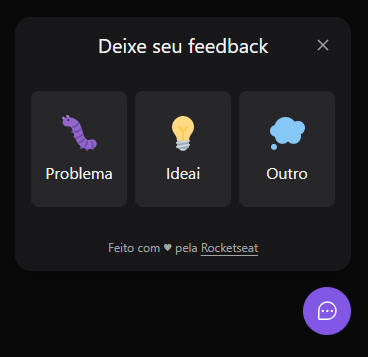
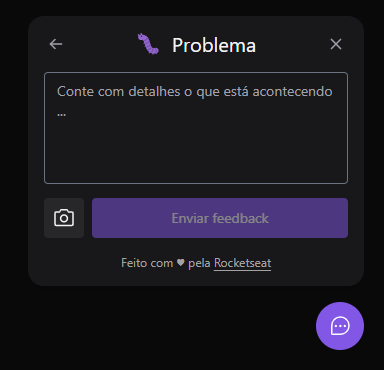
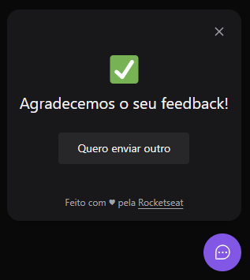

<h1 align='center'>
  
</h1>

  

  <a href="#Sobre">Sobre</a>&nbsp;&nbsp;&nbsp;|&nbsp;&nbsp;&nbsp;
  <a href="#Conheça-o-Feedget">Conheça-o-Feedget</a>&nbsp;&nbsp;&nbsp;|&nbsp;&nbsp;&nbsp;
  <a href="#Tecnologias">Tecnologias</a>&nbsp;&nbsp;&nbsp;|&nbsp;&nbsp;&nbsp;

<h1 align='center'>
  
  
  
</h1>

## Sobre

O Feedget é um widget de feedback,  o mesmo tem como finalidade o report de falhas em partes específicas de um site, sistema ou aplicação mobile. Foi desenvolvido durante a Next Level Week Return promovida pela Rocketseat.

Projeto desenvolvido do total zero usando TypeScript, contem um server(NodeJs), aplicação web(ReactJs) e mobile(React Native).

Com o desenvolvimento desse projeto aprendi mais um pouco sobre escrever teste com o JestJS, também foi aplicado o princípio da inversão de dependência do SOLID e também foi implementado o Nodemailer, um modulo do NodeJs para permitir o envio de e-mail pelo backend, na web começei a entender como o Tailwind CSS funciona e no Mobile aprendi com tirar um screnshot usando o react-native-view-shot.

## Conheça-o-Feedget

  Foi realizado o Depoy da aplicação Web na Vercel disponivel em: 
  <a href="https://feed-get-nlwreturn.vercel.app/">FeedGet App</a>

  O Depoy do backend e banco de dados PostegreSQL foram feitos na Railway.

## Tecnologias

  As seguintes ferramentas foram utilizadas na construção do projeto: 

 == Backend ==

<li>Nodejs</li>
<li>Express</li>
<li>Prisma IO</li>
<li>Jest</li>
<li>Nodemailer</li>

 == Frontend ==

<li>ReactJs</li>
<li>Tailwind CSS</li>
<li>Axios</li>

 == Modile ==

<li>React Native</li>
<li>Expo</li>
<li>Styled-Components</li>
<li>Axios</li>